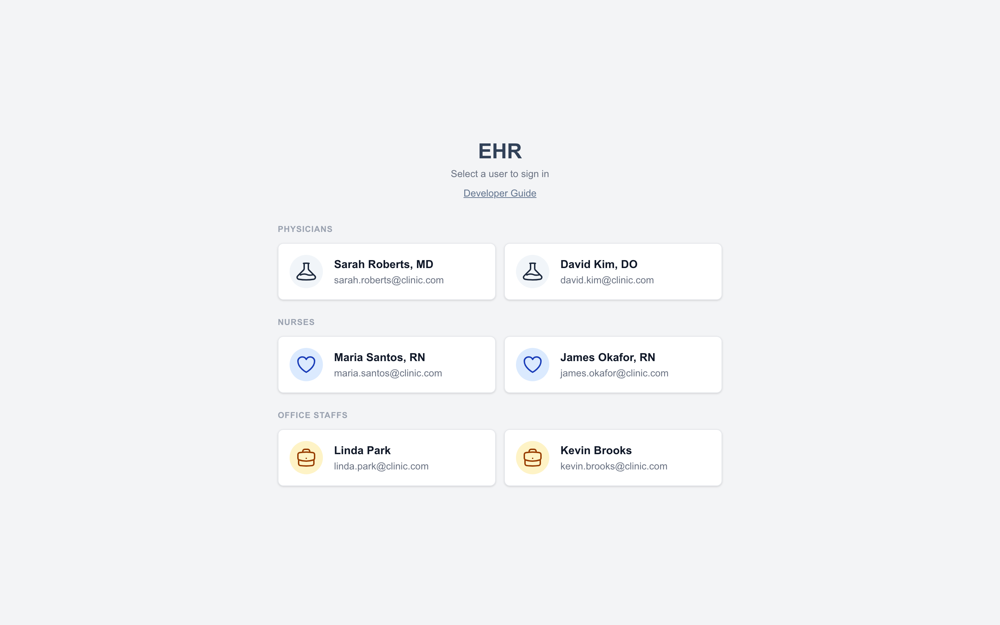
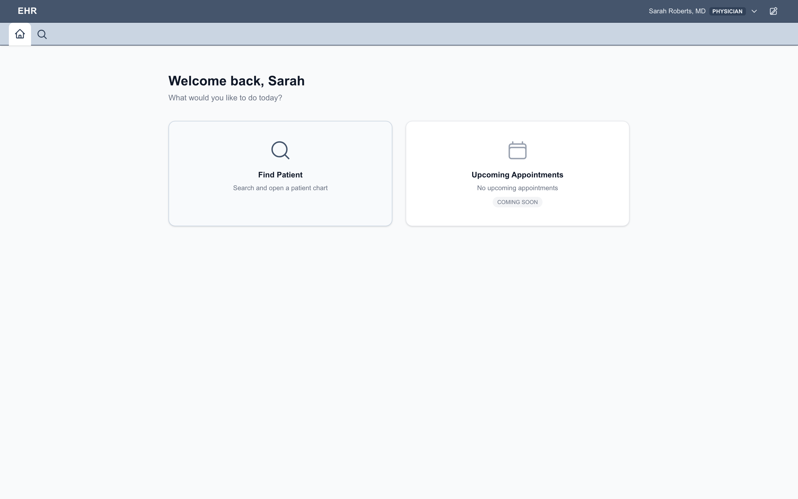
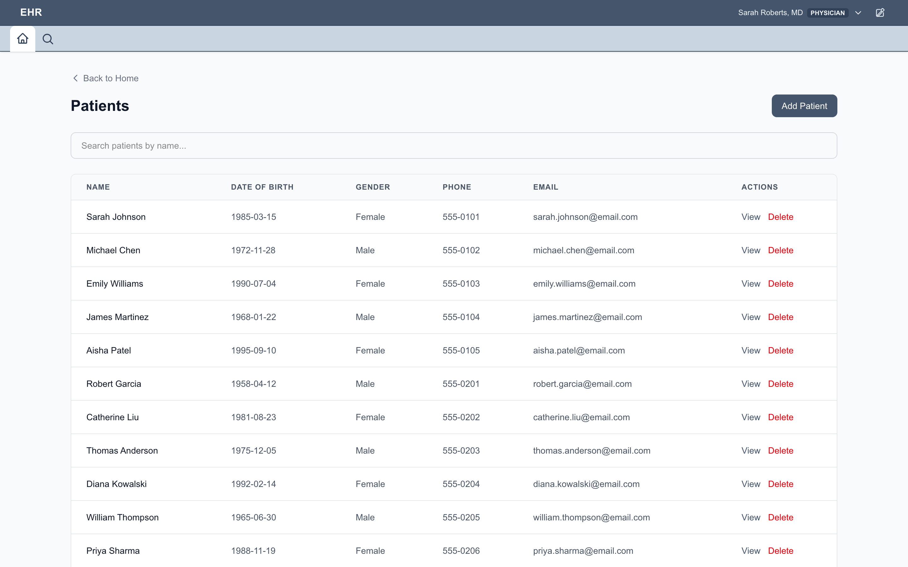
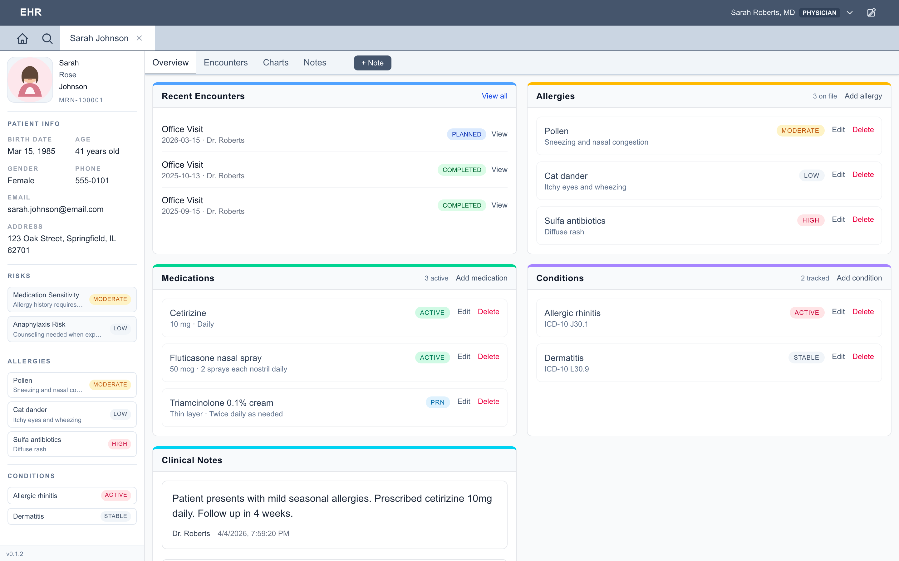
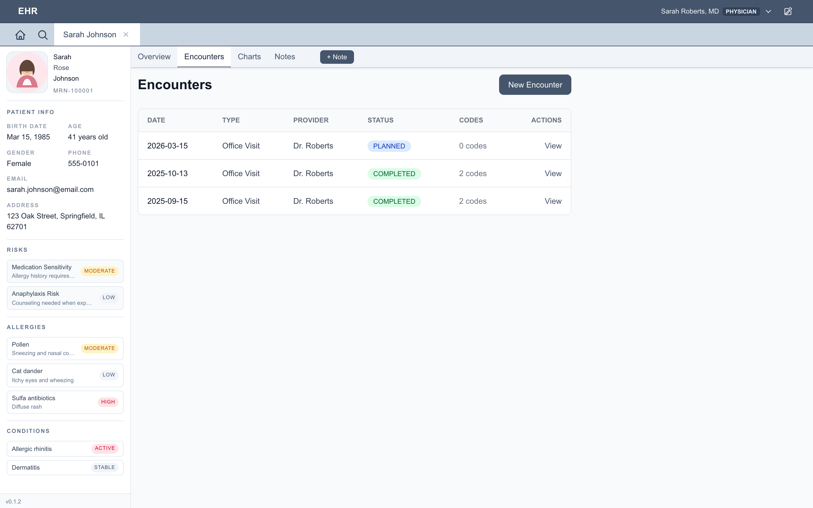
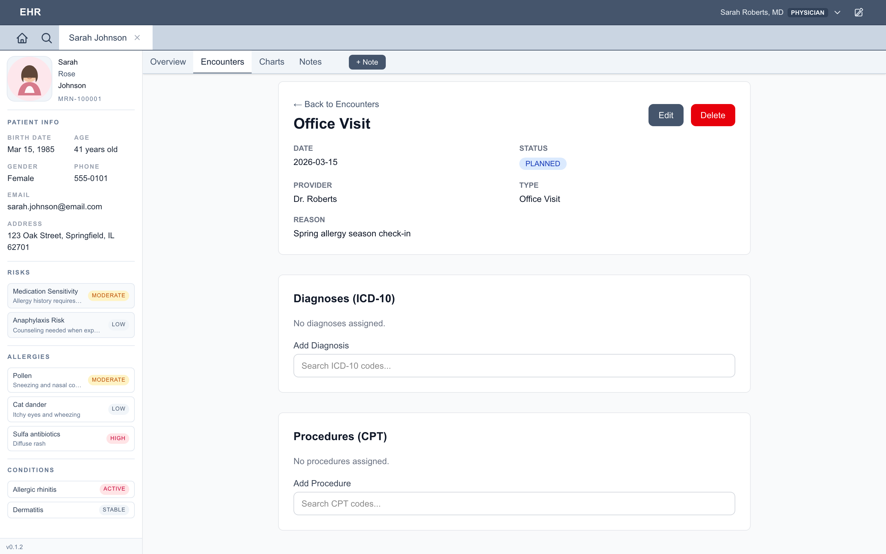
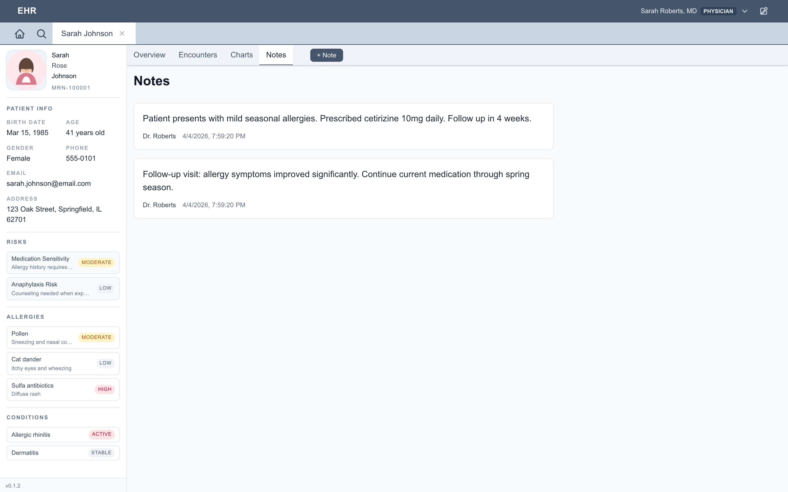
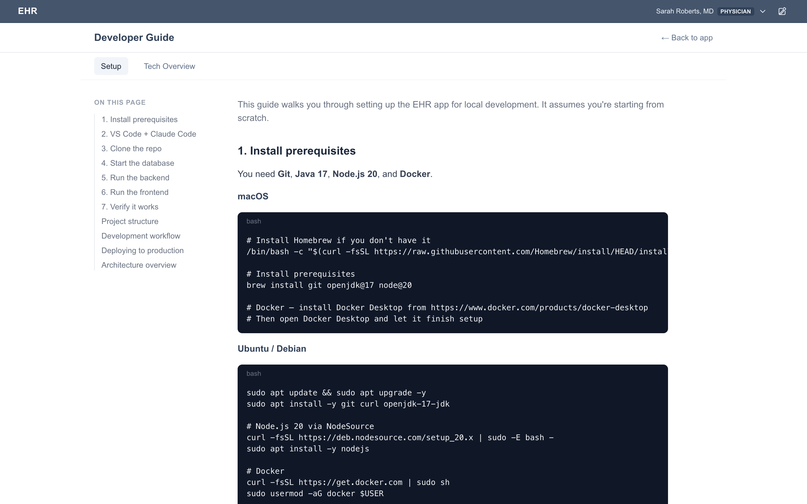

# EHR App

A full-stack electronic health records application built with Spring Boot (Kotlin), Next.js, HAPI FHIR, and PostgreSQL.

**This project is for demonstration purposes only and is not intended for production clinical use.** All patient data in this repository is synthetically generated and does not represent real individuals.

## Screenshots

Captured from the demo deployment with synthetic data. Sign in as any of the
demo users, find a patient, and work in a tabbed chart with encounters,
diagnoses and procedures, medications, allergies, conditions and notes.

<table>
  <tr>
    <td width="50%"><br><sub>Sign in as a demo user</sub></td>
    <td width="50%"><br><sub>Dashboard</sub></td>
  </tr>
  <tr>
    <td><br><sub>Patient finder</sub></td>
    <td><br><sub>Patient chart overview</sub></td>
  </tr>
  <tr>
    <td><br><sub>Encounters</sub></td>
    <td><br><sub>Encounter with ICD-10 and CPT coding</sub></td>
  </tr>
  <tr>
    <td><br><sub>Clinical notes</sub></td>
    <td><br><sub>In-app guide</sub></td>
  </tr>
</table>

The images are produced by `screenshots/capture.mjs`, a Playwright script that
clicks through a running instance. To refresh them after a UI change:

```bash
cd screenshots && npm install && npm run capture          # against the demo site
BASE_URL=http://localhost:3001 npm run capture             # against a local run
```

## 📖 Documentation

[Read the Docs](https://ehr-app.readthedocs.io/en/latest/)

## License

This software is proprietary. All rights reserved. See [LICENSE](LICENSE) for details.
